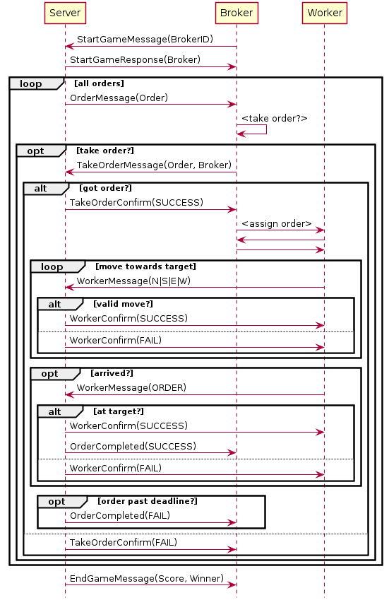

AOT JIAC Exercise for Summer Semester 2021
==========================================

Overview of Provided Code
-------------------------

* package `de.dailab.jiactng.aot.gridworld` contains a number of starter classes used as entry points for starting the server, the observer, the client, etc.
* package `de.dailab.jiactng.aot.gridworld.server`contains primarily the `ServerBean` which implements the server side of the interaction; it will be explained in more detail below
* package `de.dailab.jiactng.aot.gridworld.messages` contains all the messages exchanged between the Server and the Client (i.e. Broker and Workers) according to the protocol; you can add additional messages for the communication between the Broker and Workers, but the given messages must _not_ be changed or communication with the Server will not work
* package `de.dailab.jiactng.aot.gridworld.model` contains classes describing concepts in the Grid World; those are used by the Server to keep track of the current state of the game and its entities, but you can use the same classes in your Broker and Workers, as well; note that some of the model classes are also used as part of messages (e.g. `Order` and `Worker`) and like the messages themselves should _not_ be altered or communication with the official Server will not work
* package `de.dailab.jiactng.aot.gridworld.client` this package holds a simple stub for the `ClientBean` that you can use as a starting point for your implementation


Interaction between Server and Client
-------------------------------------

The following sequence diagram shows the messages exchanged between (i) the Server and the Broker and Workers, and (ii) between the Broker and its Workers. The latter has to be implemented by you, thus there are no concrete messages shown.



The following messages are exchanged between the Server and the Broker and Workers.

* the game is initialized by the Broker with a `StartGameMessage`, including the grid file to play
* the Server replies with a `StartGameResponse` holding information about the game
* for each order that becomes active
    * the Server sends an `OrderMessage` to the Broker
    * (the Broker decides whether to accept that order)
    * if so, it sends a `TakeOrderMessage` to the Server
    * the server replies with a `TakeOrderConfirm` message (`SUCCESS` or `FAIL`, see details below)
    * (the Broker decides which Worker to assign the order to)
    * the selected Worker moves towards the order, in each turn...
        * sending a `WorkerMessage` with its action to the Server
        * who replies with a `WorkerConfirm`
    * finally, when the Worker arrives at the site of the order, it sends another `WorkerMessage` to pick up the order
    * to which the Server replies with another `WorkerConfirm` (`SUCCESS` or `FAIL`)
    * if the order was actually there, and not yet expired, the Server sends a `OrderCompleted(SUCCESS)` to the Broker
    * or, if the Broker took the order but could not compete it before its deadline, an `OrderCompleted(FAIL)`
* finally, the Server sends an `EndGameMessage` to the Broker informing them about the outcome of the game

An order has to be accepted a few turns after its creation to prevent orders from being accepted in the very last moment before their completion; the actual number of turns is a parameter of the server which defaults to `3`.

To any message that is not expected (e.g. a `WorkerConfirm`) or inconsistent (e.g. a `TakeOrderMessage` with unknown game-, order-, or broker ID), the Server will respond with an `ErrorMessage` (not shown in the diagram).

Also note that:

* the server only processes 1 message per agent in 1 cycle others will be answered with FAIL
* grid file names should be relative to the class path root
* remember that you can only play on grids that the server known (when using a remote server)
* active orders can overlap
* a Worker may move around without being assigned an order
* maps can contain obstacles that are only revealed when a worker bumps into them
* the workers may have limited fuel, consuming one unit per successful move

However, for now, neither obstacles nor fuel must be used, so don't worry about those.


Orders
-------
An order can be announced at any point. Each order has it's own deadline, position and value which decreases after every execution cycle according to a `turnPenalty`. Orders are only counted as complete if the Broker accepted this order and the Worker got a confrimation for completing the order from the server.

Scoring
-------

At the end of the game, the score of your Broker will be calculated as the sum of the rewards for all accepted orders (successfully completed and failed/past deadline), minus the total number of steps taken by all workers, i.e.
```
    sum(reward(o) for o in accepted_orders) - sum(worker steps) 
```

where the reward of an order is _minus_ the order's value if it is past the deadline, otherwise the order's value minus the turn-penalty times the number of turns since its creation (but not less than zero), i.e.
```
    if turn > deadline: -value 
    else: max(value - (turnCompleted - turnCreated) * turnPenalty, 0)
```

See the `ServerBean` and the `Order.getReward` method for details.


The Server Bean
---------------

The `ServerBean` is the main component of the agent running on the server side. You can look at the code to get a better understanding what the server does, and maybe to deduce how certain things need to be done in JIAC, but you should _not_ alter the code. Remember that in the end your broker agent will run against a server agent hosted by us, using the original code, so any changes to the server may render your broker incompatible with our server!

At the top of the Server Bean a number of configuration properties are defined, along with corresponding setter methods at the end of the class. Those can be set in the Spring configuration file `server.xml`.

Since the server needs to be able to handle multiple games at once, those are stored in a map and retrieved using the `gameId` field. Thus, it is important that you include this `gameId` in each message you send to the server so it known which game you are talking about.

The bulk of the server's work can be subdivided in two main parts: Reacting to new messages, and updating the state of all active games and sending out messages accordingly. Both of these parts together make up the interaction protocol with the Broker and Workers.

The first part is done in the `handleMessage` method, which is called by a listener attached to the agent's memory, and handles them one by one, checking the type of the `payload`, getting the appropriate game from the `Map`, updating the state of the game and sending a reply.

The second part is done in the `execute()` method, which is executed in regular intervals defined by the `executionInterval` in the `server.xml` file. The server checks whether a game is over (i.e. the maximum number of turns has passed) and sends out messages to all the brokers, informing them of their scores and whether they have won the game (only relevant in multiplayer mode), and otherwise checks if any new Order has become available or if any active order reached its deadline in the current turn and informs the brokers accordingly. Finally, games that are finished are cleared up.


The Client Beans
----------------

The `BrokerBean` and `WorkerBean` can be used as a starting point for your implementation. In theory, you could implement both roles, i.e. the Broker and the Worker(s), in the same bean, but we strongly encourage you to create separate beans for the Broker and the Workers and creating one `BrokerAgent` and several `WorkerAgent`s with those beans. The maximum number of workers per game will be communicated in the actual assignments, so you know how many agents you need. You can use the `client.xml` Spring configuration for setting up the node.

Besides the beans, you may also need to create additional classes for further messages between the Broker and its Workers (only hinted in the sequence diagram), or further model elements for representing the state of the game from the Broker's perspective. (Of course, you can also use the classes used by the Server, but as mentioned before, you should not modify those or your Broker might not work any longer with a Server using the original classes.)

To implement different variations of your Broker and Worker agents you can simply create copies and modify them. After that change the `client.xml` to include your variations.


Running the Game
----------------

To run the game locally, make sure to use the `AotNode` with `parent="NodeWithJMX"` in the `settings.xml` configuration file. You need to start both the Server and the Client, e.g. using the `StartClient` and `StartServer` classes, and optionally the `StartObserver` (see below). The `ServerBean` will wait for a `StartGameMessage` by the broker and then start a game. It can also run multiple games in parallel, but (for now) each game will only have a single broker (and its workers) in it. For each running game, the Server will print some debugging information to the standard output, such as messages being sent and received, and the current state of the grid.

Later, for the evaluation, the Server Agent will run on our hosts. Do _not_ start your own Server Agent then but connect to ours by switching to the `AotNode` with `parent="AotGatewayNode"` in the `settings.xml`. We will also run an instance of the Observer Agent, hosting a very simple web site that you can use to track the current state of your game. To view the status of an active game, or the logs of a past game, visit the following URL, where `1234567890` is the ID of the game you want to see:

<http://130.149.154.9:8080/gameobserver/?gameId=1234567890>
